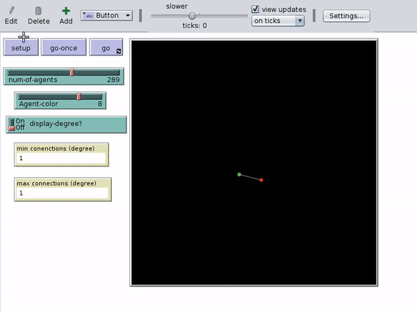

# Agent Based Modeling task for Growing Network
 

### Task

Model a growing network of colored agents that connects to agents of different colors. It is modeled using NetLogo.

### Requirements:

* NetLogo (Install from here : https://ccl.northwestern.edu/netlogo/download.shtml)

### Hyperparameters:

* Number of Agents
* Agents color
* Node density
* Maximum-Minimum Node density
* Speed of motion
